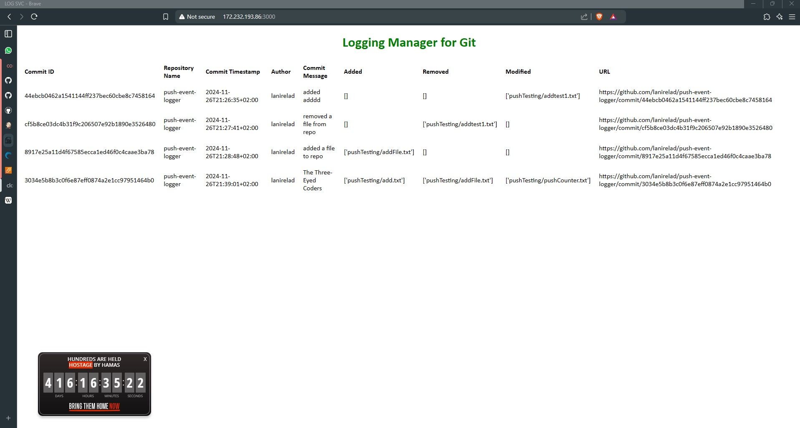

Event Logger Infrastructure - Infrastructure Setup Guide
======================================================

Overview
--------

This repository sets up the infrastructure for the **GitHub Push Event Logger** application, which is hosted on a Linode instance and configured via a Jenkins CI/CD pipeline. The infrastructure is managed by **Terraform** and **Ansible** to provision resources, configure the server environment, and deploy the Dockerized Flask application. The service listens for GitHub webhook events, logging information about pushes to a specified repository.

Key Technologies
----------------

* **Jenkins**: Used for CI/CD automation, managing the pipeline to provision, deploy, and update the infrastructure.
* **Terraform**: Automates the provisioning of a Linode instance and a GitHub webhook.
* **Ansible**: Configures the Linode instance by installing necessary packages and running the Flask application in Docker.

Table of Contents
-----------------

* [Setup Requirements](#setup-requirements)
* [Pipeline Workflow](#pipeline-workflow)
    * [1. Jenkinsfile Stages](#1-jenkinsfile-stages)
    * [2. Ansible Tasks](#2-ansible-tasks)
    * [3. Terraform Configuration](#3-terraform-configuration)
* [Environment Variables](#environment-variables)
* [Usage Instructions](#usage-instructions)

* * *

Setup Requirements
------------------

Before starting, ensure the following:

1. **Jenkins Server**: With the following plugins:
    * Git Plugin
    * Ansible Plugin
    * Docker Pipeline Plugin
    * Terraform Plugin
2. **Credentials** stored in Jenkins:
    * `linodeToken` - API token for Linode
    * `sshKey` - SSH key for accessing Linode
    * `rootPass` - Root password for the Linode instance
    * `githubToken` - GitHub token for managing repository webhooks
    * `dockerhub-credentials` - Docker Hub credentials (username and password)
    * `sudoPass` - Sudo password for specific privileged tasks, if required

* * *

Pipeline Workflow
-----------------

The `Jenkinsfile` in this repository outlines a multi-stage pipeline that performs the following steps:

### 1. **Jenkinsfile Stages**

1. **Checkout Flask App Code**: Clones the Flask application repository.
2. **Build Docker Image**: Builds the Docker image from the Flask app’s Dockerfile.
3. **Push Docker Image**: Pushes the Docker image to Docker Hub.
4. **Checkout Infrastructure Code**: Clones the infrastructure repository.
5. **Terraform Init**: Initializes Terraform.
6. **Terraform Plan**: Creates a Terraform execution plan.
7. **Terraform Apply**: Applies the Terraform plan, provisioning the Linode instance and webhook.
8. **Debug Terraform Outputs**: Outputs the Linode instance IP for debugging.
9. **Get Linode IP**: Retrieves and stores the instance IP.
10. **Copy public SSH key**: Copies the SSH public key to the Linode instance.
11. **Create Ansible Inventory**: Generates a dynamic Ansible inventory file.
12. **Run Ansible Playbook**: Executes Ansible to configure and deploy the Flask app.

### 2. **Ansible Tasks**

Ansible is used for server configuration after provisioning. Key tasks include:

* Installing necessary packages: Docker, Python, Git, etc.
* Configuring Docker and Docker Compose.
* Checking if the required port (3000) is in use and stopping any conflicting processes.
* Running the Flask app in Docker, with logs mapped to the host.
* Setting up a systemd service for the Docker container to ensure the app restarts if the server reboots.

### 3. **Terraform Configuration**

Terraform manages the infrastructure resources:

* **Linode Instance**: Creates an instance to host the Flask app, using Ubuntu as the OS.
* **GitHub Webhook**: Sets up a webhook on the GitHub repository to send push events to the Flask app endpoint.

* * *

Environment Variables
---------------------

The following environment variables are defined in the `Jenkinsfile`:

| Variable            | Description                                                     |
|---------------------|-----------------------------------------------------------------|
| `DOCKER_IMAGE`      | Docker image name and tag (e.g., `lanirelad/push-event-logger:latest`) |
| `LINODE_INSTANCE_IP`| IP of the Linode instance (populated dynamically)               |
| `FLASK_APP_REPO`    | GitHub URL for the Flask application repository                 |
| `INFRA_REPO`        | GitHub URL for the infrastructure repository                    |
| `LINODE_API_TOKEN`  | Linode API token used by Terraform                              |
| `SSH_PUBLIC_KEY`    | SSH public key for accessing the Linode instance                |
| `ROOT_PASSWORD`     | Root password for the Linode instance                           |
| `GIT_TOKEN`         | GitHub token used by Terraform to create webhooks               |
| `SUDO_PASSWORD`     | Optional, used if sudo privileges are required                  |

* * *

Usage Instructions
------------------

1.  **Clone the Repository**:
    
    ```bash
    git clone https://github.com/lanirelad/EventLoggerInfrastructure.git 
    cd EventLoggerInfrastructure
    ```
    
2.  **Set Up Jenkins Pipeline**:
    
    *   Add the `Jenkinsfile` to a Jenkins project.
    *   Define necessary credentials in Jenkins as outlined above.
    *   Run the Jenkins pipeline to initialize the infrastructure.
    
3.  **Tunneling with Ngrok**:
    
    *   To allow GitHub to reach your Linode instance, set up tunneling using Ngrok. Run the following command:
    
    ```bash
    ngrok http 3000
    ```
    
    *   Take note of the forwarding URL provided by Ngrok (e.g., `https://<random_subdomain>.ngrok.io`) to configure the webhook in GitHub.

4.  **Access the Application**:
    
    *   After the pipeline completes successfully, access the application by navigating to `http://<LINODE_INSTANCE_IP>:3000` in your web browser.
    
5.  **Available Routes**:
    
    *   **Main Page** (`/`): Displays a list of commits sorted by timestamp that were received via the GitHub webhook.
    *   **Webhook Endpoint** (`/webhook`): This route receives POST requests from GitHub containing webhook data. It processes and saves the data automatically.
    *   **Payload Data** (`/payload`): Displays the JSON data saved from the incoming webhooks.
    *   **Log File** (`/log`): Shows the contents of the webhook data log file, preserving formatting for easier reading.

6.  **Access Logs**:
    
    *   Logs are saved on the Linode instance at `/var/log/push-event-logger` (accessible through SSH or from within the Docker container).

* * *

Outcome
------------------
